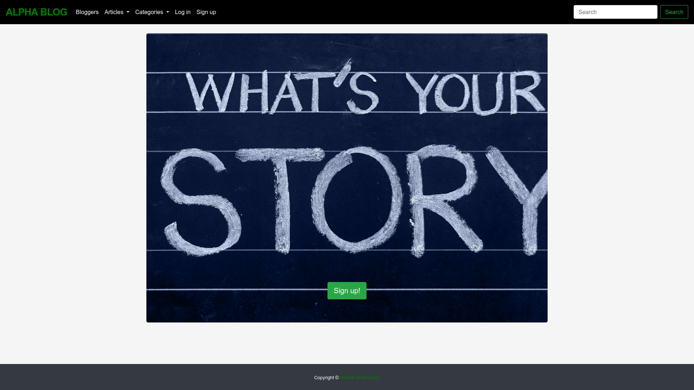

# Alpha-Blogy

> The application allows users to log in and write articles and edit them as well as commenting on other people's articles and more.

## Built With

- Ruby
- Ruby on rails
- bootstrap
- postgresql

## Live Demo

[Live Demo Link](https://alphablogy.herokuapp.com/)

To get a local copy up and running, follow these simple example steps.

### ruby 3

### ruby on rails 6

### Install yarn

### Run rails s

## Authors

👤 **Shaher Shamroukh**
 
[<code></code>](https://github.com/Shaher-11)
[<code></code>](https://twitter.com/ShaherShamroukh/)
[<code></code>](https://www.linkedin.com/in/shaher-shamroukh/)
 
 

## Show your support

Give a ⭐️ if you like this project!

## Acknowledgments

- Rails guide

## 📝 License

This project is [MIT](lic.url) licensed.
